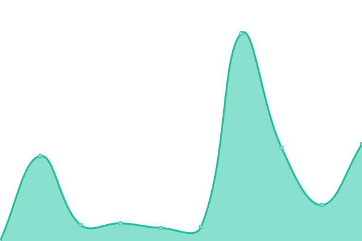

# [📈 Live Status](https://demo.upptime.js.org): <!--live status--> **🟩 All systems operational**

This repository contains the open-source uptime monitor and status page for [simon2871](https://demo.upptime.js.org), powered by [Upptime](https://github.com/upptime/upptime).

With [Upptime](https://upptime.js.org), you can get your own unlimited and free uptime monitor and status page, powered entirely by a GitHub repository. We use [Issues](https://github.com/simon2871/fs-websitemonitor/issues) as incident reports, [Actions](https://github.com/simon2871/fs-websitemonitor/actions) as uptime monitors, and [Pages](https://demo.upptime.js.org) for the status page.

<!--start: status pages-->
<!-- This summary is generated by Upptime (https://github.com/upptime/upptime) -->
<!-- Do not edit this manually, your changes will be overwritten -->
<!-- prettier-ignore -->
| URL | Status | History | Response Time | Uptime |
| --- | ------ | ------- | ------------- | ------ |
|  Full Steam | 🟩 Up | [full-steam.yml](https://github.com/simon2871/fs-websitemonitor/commits/HEAD/history/full-steam.yml) | 

 2962ms
     
 | 

<a href="https://simon2871.github.io/fs-websitemonitor/history/full-steam">100.00%</a>
    

|  Cloud Assess | 🟩 Up | [cloud-assess.yml](https://github.com/simon2871/fs-websitemonitor/commits/HEAD/history/cloud-assess.yml) | 

 2085ms
     
 | 

<a href="https://simon2871.github.io/fs-websitemonitor/history/cloud-assess">100.00%</a>
    

|  Web English | 🟩 Up | [web-english.yml](https://github.com/simon2871/fs-websitemonitor/commits/HEAD/history/web-english.yml) | 

 1652ms
     
 | 

<a href="https://simon2871.github.io/fs-websitemonitor/history/web-english">100.00%</a>
    

|  James Finance | 🟩 Up | [james-finance.yml](https://github.com/simon2871/fs-websitemonitor/commits/HEAD/history/james-finance.yml) | 

 4904ms
     
 | 

<a href="https://simon2871.github.io/fs-websitemonitor/history/james-finance">100.00%</a>
    

|  Hailer Rail | 🟩 Up | [hailer-rail.yml](https://github.com/simon2871/fs-websitemonitor/commits/HEAD/history/hailer-rail.yml) | 

 10376ms
     
 | 

<a href="https://simon2871.github.io/fs-websitemonitor/history/hailer-rail">100.00%</a>
    

|  Pro Safe | 🟩 Up | [pro-safe.yml](https://github.com/simon2871/fs-websitemonitor/commits/HEAD/history/pro-safe.yml) | 

 7463ms
     
 | 

<a href="https://simon2871.github.io/fs-websitemonitor/history/pro-safe">100.00%</a>
    

|  Lyson NZ | 🟩 Up | [lyson-nz.yml](https://github.com/simon2871/fs-websitemonitor/commits/HEAD/history/lyson-nz.yml) | 

 5338ms
     
 | 

<a href="https://simon2871.github.io/fs-websitemonitor/history/lyson-nz">99.05%</a>
    

|  Lyson Au | 🟩 Up | [lyson-au.yml](https://github.com/simon2871/fs-websitemonitor/commits/HEAD/history/lyson-au.yml) | 

 3349ms
     
 | 

<a href="https://simon2871.github.io/fs-websitemonitor/history/lyson-au">98.64%</a>
    

|  Hailer Training | 🟩 Up | [hailer-training.yml](https://github.com/simon2871/fs-websitemonitor/commits/HEAD/history/hailer-training.yml) | 

 4990ms
     
 | 

<a href="https://simon2871.github.io/fs-websitemonitor/history/hailer-training">100.00%</a>
    

|  Snow Boards NZ | 🟩 Up | [snow-boards-nz.yml](https://github.com/simon2871/fs-websitemonitor/commits/HEAD/history/snow-boards-nz.yml) | 

 5365ms
     
 | 

<a href="https://simon2871.github.io/fs-websitemonitor/history/snow-boards-nz">100.00%</a>
    

|  Victoris Webby | 🟩 Up | [victoris-webby.yml](https://github.com/simon2871/fs-websitemonitor/commits/HEAD/history/victoris-webby.yml) | 

 7778ms
     
 | 

<a href="https://simon2871.github.io/fs-websitemonitor/history/victoris-webby">100.00%</a>
    

|  Dunn Right | 🟩 Up | [dunn-right.yml](https://github.com/simon2871/fs-websitemonitor/commits/HEAD/history/dunn-right.yml) | 

 4645ms
     
 | 

<a href="https://simon2871.github.io/fs-websitemonitor/history/dunn-right">100.00%</a>
    

|  Metrocopiers | 🟩 Up | [metrocopiers.yml](https://github.com/simon2871/fs-websitemonitor/commits/HEAD/history/metrocopiers.yml) | 

 2420ms
     
 | 

<a href="https://simon2871.github.io/fs-websitemonitor/history/metrocopiers">100.00%</a>
    

|  ANIBT | 🟩 Up | [anibt.yml](https://github.com/simon2871/fs-websitemonitor/commits/HEAD/history/anibt.yml) | 

 4529ms
     
 | 

<a href="https://simon2871.github.io/fs-websitemonitor/history/anibt">100.00%</a>
    

<!--end: status pages-->

[**Visit our status website →**](https://demo.upptime.js.org)

## 📄 License

- Powered by: [Upptime](https://github.com/upptime/upptime)
- Code: [MIT](./LICENSE) © [simon2871](https://demo.upptime.js.org)
- Data in the `./history` directory: [Open Database License](https://opendatacommons.org/licenses/odbl/1-0/)
