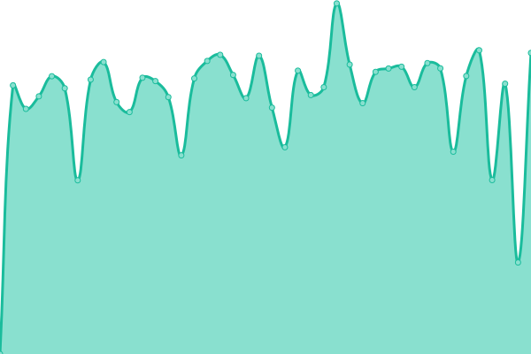

# [📈 Live Status](https://demo.upptime.js.org): <!--live status--> **🟧 Partial outage**

This repository contains the open-source uptime monitor and status page for [simon2871](https://demo.upptime.js.org), powered by [Upptime](https://github.com/upptime/upptime).

With [Upptime](https://upptime.js.org), you can get your own unlimited and free uptime monitor and status page, powered entirely by a GitHub repository. We use [Issues](https://github.com/simon2871/fs-websitemonitor/issues) as incident reports, [Actions](https://github.com/simon2871/fs-websitemonitor/actions) as uptime monitors, and [Pages](https://demo.upptime.js.org) for the status page.

<!--start: status pages-->
<!-- This summary is generated by Upptime (https://github.com/upptime/upptime) -->
<!-- Do not edit this manually, your changes will be overwritten -->
<!-- prettier-ignore -->
| URL | Status | History | Response Time | Uptime |
| --- | ------ | ------- | ------------- | ------ |
|  Full Steam | 🟩 Up | [full-steam.yml](https://github.com/simon2871/fs-websitemonitor/commits/HEAD/history/full-steam.yml) | 

 4933ms
     
 | 

<a href="https://simon2871.github.io/fs-websitemonitor/history/full-steam">98.67%</a>
    

|  Cloud Assess | 🟩 Up | [cloud-assess.yml](https://github.com/simon2871/fs-websitemonitor/commits/HEAD/history/cloud-assess.yml) | 

 295ms
     
 | 

<a href="https://simon2871.github.io/fs-websitemonitor/history/cloud-assess">100.00%</a>
    

|  Web English | 🟥 Down | [web-english.yml](https://github.com/simon2871/fs-websitemonitor/commits/HEAD/history/web-english.yml) | 

 1439ms
     
 | 

<a href="https://simon2871.github.io/fs-websitemonitor/history/web-english">99.96%</a>
    

|  James Finance | 🟥 Down | [james-finance.yml](https://github.com/simon2871/fs-websitemonitor/commits/HEAD/history/james-finance.yml) | 

 4108ms
     
 | 

<a href="https://simon2871.github.io/fs-websitemonitor/history/james-finance">99.69%</a>
    

|  Hailer Rail | 🟩 Up | [hailer-rail.yml](https://github.com/simon2871/fs-websitemonitor/commits/HEAD/history/hailer-rail.yml) | 

 10424ms
     
 | 

<a href="https://simon2871.github.io/fs-websitemonitor/history/hailer-rail">100.00%</a>
    

|  Pro Safe | 🟥 Down | [pro-safe.yml](https://github.com/simon2871/fs-websitemonitor/commits/HEAD/history/pro-safe.yml) | 

 7059ms
     
 | 

<a href="https://simon2871.github.io/fs-websitemonitor/history/pro-safe">99.98%</a>
    

|  Lyson NZ | 🟥 Down | [lyson-nz.yml](https://github.com/simon2871/fs-websitemonitor/commits/HEAD/history/lyson-nz.yml) | 

 1448ms
     
 | 

<a href="https://simon2871.github.io/fs-websitemonitor/history/lyson-nz">99.98%</a>
    

|  Lyson Au | 🟩 Up | [lyson-au.yml](https://github.com/simon2871/fs-websitemonitor/commits/HEAD/history/lyson-au.yml) | 

 4360ms
     
 | 

<a href="https://simon2871.github.io/fs-websitemonitor/history/lyson-au">100.00%</a>
    

|  Hailer Training | 🟥 Down | [hailer-training.yml](https://github.com/simon2871/fs-websitemonitor/commits/HEAD/history/hailer-training.yml) | 

 4157ms
     
 | 

<a href="https://simon2871.github.io/fs-websitemonitor/history/hailer-training">99.99%</a>
    

|  Snow Boards NZ | 🟩 Up | [snow-boards-nz.yml](https://github.com/simon2871/fs-websitemonitor/commits/HEAD/history/snow-boards-nz.yml) | 

 5658ms
     
 | 

<a href="https://simon2871.github.io/fs-websitemonitor/history/snow-boards-nz">100.00%</a>
    

|  Victoris Webby | 🟩 Up | [victoris-webby.yml](https://github.com/simon2871/fs-websitemonitor/commits/HEAD/history/victoris-webby.yml) | 

 7756ms
     
 | 

<a href="https://simon2871.github.io/fs-websitemonitor/history/victoris-webby">100.00%</a>
    

|  Dunn Right | 🟥 Down | [dunn-right.yml](https://github.com/simon2871/fs-websitemonitor/commits/HEAD/history/dunn-right.yml) | 

 5828ms
     
 | 

<a href="https://simon2871.github.io/fs-websitemonitor/history/dunn-right">100.00%</a>
    

|  Metrocopiers | 🟩 Up | [metrocopiers.yml](https://github.com/simon2871/fs-websitemonitor/commits/HEAD/history/metrocopiers.yml) | 

 1085ms
     
 | 

<a href="https://simon2871.github.io/fs-websitemonitor/history/metrocopiers">99.79%</a>
    

<!--end: status pages-->

[**Visit our status website →**](https://demo.upptime.js.org)

## 📄 License

- Powered by: [Upptime](https://github.com/upptime/upptime)
- Code: [MIT](./LICENSE) © [simon2871](https://demo.upptime.js.org)
- Data in the `./history` directory: [Open Database License](https://opendatacommons.org/licenses/odbl/1-0/)
